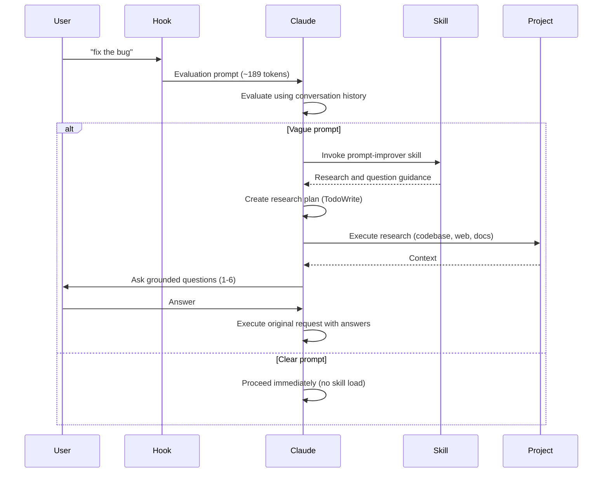

## Introduction

Claude Code Prompt Improver uses a **two-layer architecture** that separates prompt evaluation from prompt enrichment. This design achieves significant efficiency gains while maintaining comprehensive support for vague prompts.

<Info>
**Key Achievement**: 31% token reduction (v0.4.0) by moving evaluation to the hook layer and using progressive disclosure for skill content.
</Info>

## Two-Layer Design

The architecture consists of two distinct layers:

### Layer 1: Hook (Evaluation)

**Location**: `scripts/improve-prompt.py`  
**Purpose**: Fast evaluation orchestrator  
**Token Cost**: ~189 tokens per prompt

**Responsibilities**:
- Intercept prompts via stdin/stdout JSON
- Handle bypass prefixes (`*`, `/`, `#`)
- Wrap prompts with evaluation instructions
- Let Claude evaluate clarity using conversation history
- Instruct Claude to invoke skill if vague

### Layer 2: Skill (Enrichment)

**Location**: `skills/prompt-improver/`  
**Purpose**: Research and question guidance  
**Token Cost**: Loaded only when needed

**Responsibilities**:
- Guide systematic research workflow
- Provide question generation patterns
- Offer reference materials on-demand
- Support 4-phase enrichment process

## Why Skill-Based Architecture?

The migration from hook-only to skill-based architecture (v0.4.0) delivered measurable benefits:

<AccordionGroup>
  <Accordion title="Token Efficiency">
    **Before (v0.3.x)**:
    - All evaluation logic embedded in hook
    - ~275 tokens per prompt
    - No distinction between clear and vague prompts

    **After (v0.4.0)**:
    - Hook contains only evaluation wrapper (~189 tokens)
    - Skill loads only for vague prompts
    - 31% reduction in overhead
    - Clear prompts have zero skill overhead
  </Accordion>

  <Accordion title="Maintainability">
    - Logic written in Markdown (easier to update than Python)
    - Reference materials separate from core workflow
    - Can modify question patterns without touching hook code
    - Version control-friendly documentation format
  </Accordion>

  <Accordion title="Reusability">
    - Skill can be invoked manually: `Use the prompt-improver skill to research and clarify...`
    - Other hooks or workflows can leverage the skill
    - Reference files are self-contained and can be used independently
  </Accordion>

  <Accordion title="Progressive Disclosure">
    - Core workflow in SKILL.md (~170 lines)
    - Detailed references load only when needed:
      - `question-patterns.md` (200-300 lines)
      - `research-strategies.md` (300-400 lines)
      - `examples.md` (200-300 lines)
    - Zero context penalty for unused reference materials
  </Accordion>
</AccordionGroup>

## Execution Flow

Here's how prompts flow through the system:



## Component Comparison

<CardGroup cols={2}>
  <Card title="Hook Responsibilities" icon="filter">
    - Intercept every prompt
    - Parse JSON input/output
    - Handle bypass prefixes
    - Wrap with evaluation prompt
    - Lightweight (~70 lines Python)
  </Card>

  <Card title="Skill Responsibilities" icon="magnifying-glass">
    - Guide research planning
    - Provide question templates
    - Offer best practice patterns
    - Progressive reference loading
    - Rich (~170 lines + references)
  </Card>
</CardGroup>

## Token Overhead Analysis

### Clear Prompts Flow

1. Hook wraps with evaluation prompt (~189 tokens)
2. Claude evaluates: prompt is clear
3. Claude proceeds immediately (no skill invocation)
4. **Total overhead: ~189 tokens**

### Vague Prompts Flow

1. Hook wraps with evaluation prompt (~189 tokens)
2. Claude evaluates: prompt is vague
3. Claude invokes `prompt-improver` skill
4. Skill loads research/question guidance
5. Claude creates research plan, gathers context, asks questions
6. **Total overhead: ~189 tokens + skill load**

<Note>
**30-message session impact**: ~5.7k tokens total overhead (2.8% of 200k context window), down from 8.3k tokens (4.1%) in v0.3.x
</Note>

## Design Rationale

### Why Main Session (Not Subagent)?

The architecture runs in the main Claude session rather than spawning subagents:

- **Conversation history access**: Can check if context already exists
- **No redundant exploration**: Avoids re-researching known information
- **Transparency**: User sees evaluation process in conversation
- **Efficiency**: Single session more efficient than agent spawning

### Why JSON Hook Interface?

The hook uses stdin/stdout JSON per Claude Code specification:

```python
# Input format
{
  "prompt": "user's original prompt text"
}

# Output format
{
  "hookSpecificOutput": {
    "hookEventName": "UserPromptSubmit",
    "additionalContext": "wrapped prompt with evaluation instructions"
  }
}
```

This enables:
- Standard integration with Claude Code
- Clean separation of concerns
- Easy testing via subprocess
- Cross-platform compatibility

## Next Steps

<CardGroup cols={3}>
  <Card title="Hook System" icon="webhook" href="/architecture/hook-system">
    Deep dive into evaluation logic, bypass handling, and JSON structure
  </Card>
  
  <Card title="Skill System" icon="book-open" href="/architecture/skill-system">
    Explore the 4-phase workflow and reference file structure
  </Card>
  
  <Card title="Progressive Disclosure" icon="layer-group" href="/architecture/progressive-disclosure">
    Learn how token efficiency scales with prompt clarity
  </Card>
</CardGroup>