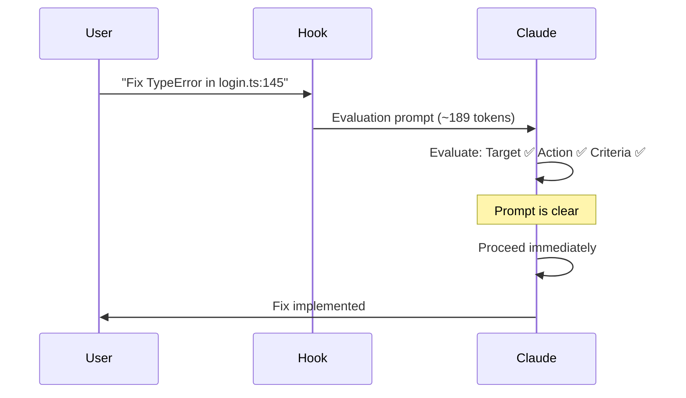
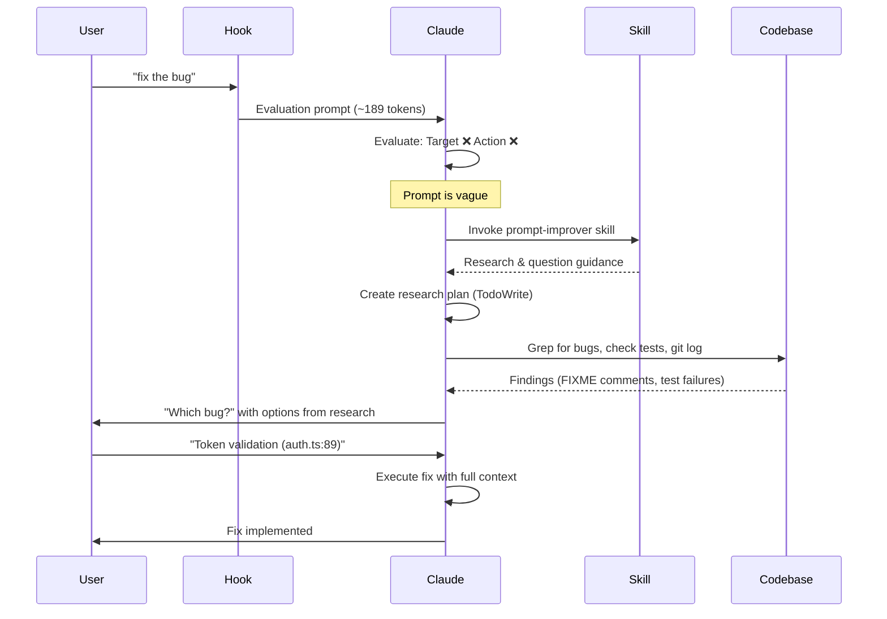

The prompt improver evaluates every prompt to decide whether to proceed immediately or research and ask clarifying questions. This page shows what distinguishes clear from vague prompts and the resulting flow differences.

## Evaluation Criteria

Every prompt is evaluated against four criteria:

<CardGroup cols={2}>
  <Card title="Target" icon="bullseye">
    Is it clear **what** needs to be changed?
    
    ✅ Specific file, function, or component
    
    ❌ Generic reference or missing entirely
  </Card>
  <Card title="Action" icon="wrench">
    Is it clear **how** to change it?
    
    ✅ Specific modification described
    
    ❌ Vague verbs ("fix", "improve", "better")
  </Card>
  <Card title="Criteria" icon="check">
    Is it clear **when** it's done correctly?
    
    ✅ Success criteria defined
    
    ❌ Subjective or undefined goals
  </Card>
  <Card title="Context" icon="comment">
    Does conversation history provide clarity?
    
    ✅ Recent errors, file viewing, or discussion
    
    ❌ No relevant context available
  </Card>
</CardGroup>

---

## Side-by-Side Comparisons

### Bug Fixes

<Tabs>
  <Tab title="Vague">
    ```bash
    $ claude "fix the bug"
    ```

    **Evaluation:**
    - Target: ❌ (what bug? where?)
    - Action: ❌ (what's broken?)
    - Criteria: ~ (bug fixed, but which?)
    - Context: No recent errors in conversation

    **Decision:** RESEARCH AND ASK QUESTIONS

    **Flow:**
    ```mermaid
    graph LR
      A[User: fix the bug] --> B[Hook: Evaluate]
      B --> C[Vague: Invoke skill]
      C --> D[Research codebase]
      D --> E[Find bugs]
      E --> F[Ask: Which bug?]
      F --> G[User selects]
      G --> H[Execute fix]
    ```

    **What makes it vague:**
    - No file mentioned
    - No error message provided
    - No symptom described
    - "The bug" assumes knowledge

    **Questions Claude asks:**
    ```
    Which bug should be fixed?
      ○ Token validation (auth.ts:89) - FIXME comment, 2 failing tests
      ○ Login redirect (recent commit) - May have residual issues
      ○ Invalid token logging (auth.ts:145) - Errors in logs
    ```
  </Tab>

  <Tab title="Clear">
    ```bash
    $ claude "Fix the TypeError at line 145 in src/auth/login.ts where user.profile.name is undefined"
    ```

    **Evaluation:**
    - Target: ✅ (login.ts:145)
    - Action: ✅ (fix TypeError, handle undefined)
    - Criteria: ✅ (no TypeError, safe access)
    - Context: Error details provided

    **Decision:** PROCEED IMMEDIATELY

    **Flow:**
    ```mermaid
    graph LR
      A[User: Fix TypeError...] --> B[Hook: Evaluate]
      B --> C[Clear: Proceed]
      C --> D[Execute fix]
    ```

    **What makes it clear:**
    - Specific file: src/auth/login.ts
    - Exact line: 145
    - Error type: TypeError
    - Root cause: user.profile.name is undefined

    **No questions asked - Claude proceeds directly:**
    ```typescript
    // Before (line 145)
    const displayName = user.profile.name;

    // After (line 145)
    const displayName = user?.profile?.name ?? 'Anonymous';
    ```
  </Tab>
</Tabs>

---

### Refactoring

<Tabs>
  <Tab title="Vague">
    ```bash
    $ claude "refactor the code to be better"
    ```

    **Evaluation:**
    - Target: ❌ (what code?)
    - Action: ❌ ("better" is subjective)
    - Criteria: ❌ (what defines "better"?)
    - Context: User recently opened src/api/users.ts

    **Decision:** RESEARCH AND ASK QUESTIONS (even with file context, "better" is too vague)

    **Flow:**
    1. Research src/api/users.ts (450 lines, mixed concerns)
    2. Check for patterns (ProductService exists)
    3. Ask what "better" means (service layer, split files, reduce complexity)

    **What makes it vague:**
    - "Better" is subjective
    - No specific improvement mentioned
    - Multiple valid interpretations

    **Questions Claude asks:**
    ```
    What aspect should be improved?
      ○ Extract service layer - Match ProductService pattern
      ○ Split into multiple files - Break up 450 lines
      ○ Reduce function complexity - Refactor 89-line functions

    Should this follow ProductService pattern?
      ○ Yes, match ProductService - Maintain consistency
      ○ No, use different approach - New pattern opportunity
    ```
  </Tab>

  <Tab title="Clear">
    ```bash
    $ claude "Refactor the getUserById function in src/api/users.ts to use async/await instead of promise chains"
    ```

    **Evaluation:**
    - Target: ✅ (getUserById in src/api/users.ts)
    - Action: ✅ (convert to async/await)
    - Criteria: ✅ (no promise chains, use async/await)
    - Context: Not needed

    **Decision:** PROCEED IMMEDIATELY

    **Flow:**
    Claude directly refactors without questions.

    **What makes it clear:**
    - Specific function: getUserById
    - Specific file: src/api/users.ts
    - Specific change: promise chains → async/await
    - Clear success: no .then() chains

    **No questions asked:**
    ```javascript
    // Before
    function getUserById(id) {
      return db.users.findOne({id})
        .then(user => validateUser(user))
        .then(validatedUser => formatResponse(validatedUser))
        .catch(error => handleError(error));
    }

    // After
    async function getUserById(id) {
      try {
        const user = await db.users.findOne({id});
        const validatedUser = await validateUser(user);
        return formatResponse(validatedUser);
      } catch (error) {
        return handleError(error);
      }
    }
    ```
  </Tab>
</Tabs>

---

### Feature Requests

<Tabs>
  <Tab title="Vague">
    ```bash
    $ claude "add authentication"
    ```

    **Evaluation:**
    - Target: ~ (app-wide, but clear scope)
    - Action: ✅ (add authentication)
    - Criteria: ❌ (what type? what approach?)
    - Context: No auth currently exists

    **Decision:** RESEARCH AND ASK QUESTIONS

    **Flow:**
    1. Research stack (Express + MongoDB + mobile requirement)
    2. Research best practices (JWT for microservices)
    3. Ask about approach, storage, scope

    **What makes it vague:**
    - No authentication method specified
    - No storage strategy mentioned
    - Scope unclear (just login? password reset? RBAC?)
    - Multiple architectural approaches possible

    **Questions Claude asks:**
    ```
    Which authentication method?
      ○ JWT with refresh tokens - Best for microservices + mobile
      ○ Session-based with MongoDB - Simpler but less scalable
      ○ OAuth 2.0 integration - Third-party providers

    Where should tokens be stored?
      ○ HttpOnly cookies - Best for web, XSS protection
      ○ Authorization header - Required for mobile
      ○ Both - Maximum flexibility

    What should be included? (multi-select)
      ☑ Login/register endpoints
      ☐ Password reset flow
      ☑ Role-based access control
      ☐ Email verification
    ```
  </Tab>

  <Tab title="Clear">
    ```bash
    $ claude "Add input validation to the registration form using Joi schema. Validate:
    - Email (required, valid format)
    - Password (required, min 8 characters, must include number and special char)
    - Username (required, 3-20 characters, alphanumeric only)"
    ```

    **Evaluation:**
    - Target: ✅ (registration form)
    - Action: ✅ (add Joi validation)
    - Criteria: ✅ (specific validation rules listed)
    - Context: All requirements provided

    **Decision:** PROCEED IMMEDIATELY

    **Flow:**
    Claude implements the exact validation schema without questions.

    **What makes it clear:**
    - Specific library: Joi
    - Specific target: registration form
    - Exact validation rules for each field
    - No ambiguity about requirements

    **No questions asked:**
    ```javascript
    const Joi = require('joi');

    const registrationSchema = Joi.object({
      email: Joi.string()
        .email()
        .required(),
      
      password: Joi.string()
        .min(8)
        .pattern(/^(?=.*[0-9])(?=.*[!@#$%^&*])/)
        .required(),
      
      username: Joi.string()
        .alphanum()
        .min(3)
        .max(20)
        .required()
    });
    ```
  </Tab>
</Tabs>

---

## Context-Dependent Evaluation

Sometimes conversation history provides the missing context that makes a vague prompt clear.

<AccordionGroup>
  <Accordion title="File Viewing Context">
    **Scenario:**
    ```
    [System: User opened src/components/LoginForm.tsx]
    User: "refactor this to use hooks"
    ```

    **Evaluation:**
    - Target: ✅ (LoginForm.tsx from file viewing)
    - Action: ✅ (refactor to hooks)
    - Criteria: ✅ (convert class to functional component)
    - Context: ✅ (file viewing provides target)

    **Decision:** PROCEED IMMEDIATELY

    Without file context, "this" would be ambiguous. File viewing makes it clear.
  </Accordion>

  <Accordion title="Recent Error Message">
    **Scenario:**
    ```
    Claude: Error: ECONNREFUSED at 127.0.0.1:5432
    User: "fix this connection error"
    ```

    **Evaluation:**
    - Target: ✅ (database connection from error)
    - Action: ✅ (fix connection refused)
    - Criteria: ✅ (successful connection)
    - Context: ✅ (error message provides details)

    **Decision:** PROCEED IMMEDIATELY

    Recent error in conversation provides all needed context.
  </Accordion>

  <Accordion title="Ongoing Discussion">
    **Scenario:**
    ```
    User: "Should I use Prisma or TypeORM?"
    Claude: "Prisma has better TypeScript support..."
    User: "ok let's go with Prisma"
    User: "set it up"
    ```

    **Evaluation:**
    - Target: ✅ (Prisma from discussion)
    - Action: ✅ (set up Prisma)
    - Criteria: ✅ (working Prisma config)
    - Context: ✅ (decision made in conversation)

    **Decision:** PROCEED

    Conversation history clarifies what "it" refers to.
  </Accordion>

  <Accordion title="No Helpful Context">
    **Scenario:**
    ```
    [No recent conversation about auth]
    User: "fix the error"
    ```

    **Evaluation:**
    - Target: ❌ (what error?)
    - Action: ❌ (what's wrong?)
    - Criteria: ❌ (when is it fixed?)
    - Context: ❌ (no relevant history)

    **Decision:** RESEARCH AND ASK QUESTIONS

    No context exists to clarify the vague prompt.
  </Accordion>
</AccordionGroup>

---

## Flow Differences

### Clear Prompt Flow (Zero Skill Overhead)



**Overhead:** ~189 tokens (evaluation only)

**No skill invocation, no research, no questions**

---

### Vague Prompt Flow (Research + Questions)



**Overhead:** ~189 tokens + skill load + research

**Comprehensive flow: research → questions → execution**

---

## Bypass Prefixes

You can skip evaluation entirely using bypass prefixes.

<Tabs>
  <Tab title="Asterisk (*)">
    **Usage:**
    ```bash
    $ claude "* just add a quick comment"
    ```

    **Effect:**
    - Bypass prefix `*` detected
    - Strip `*` from prompt
    - Pass through as: "just add a quick comment"
    - **No evaluation, no skill invocation**

    **When to use:** Quick, trivial tasks where you don't want any evaluation overhead.
  </Tab>

  <Tab title="Slash (/)">
    **Usage:**
    ```bash
    $ claude "/commit"
    $ claude "/help"
    ```

    **Effect:**
    - Slash command detected
    - Pass through to slash command system
    - **No evaluation**

    **When to use:** Slash commands automatically bypass.
  </Tab>

  <Tab title="Hash (#)">
    **Usage:**
    ```bash
    $ claude "# remember to use TypeScript strict mode"
    ```

    **Effect:**
    - Hash prefix detected (memory/note)
    - Pass through to memory system
    - **No evaluation**

    **When to use:** Memorize commands automatically bypass.
  </Tab>
</Tabs>

---

## Quick Reference: Clear vs Vague

<CardGroup cols={2}>
  <Card title="Clear Prompts" icon="circle-check" color="#10b981">
    **Characteristics:**
    - Specific file/function mentioned
    - Concrete action described
    - Success criteria defined
    - Error message included (for bugs)

    **Examples:**
    - "Fix TypeError in auth.ts:145"
    - "Refactor getUserById to use async/await"
    - "Add Joi validation to registration form"

    **Flow:**
    - Evaluation only (~189 tokens)
    - No skill invocation
    - Immediate execution
  </Card>

  <Card title="Vague Prompts" icon="circle-question" color="#f59e0b">
    **Characteristics:**
    - Generic verbs ("fix", "improve", "add")
    - No specific target
    - Subjective goals ("better", "faster")
    - Missing requirements

    **Examples:**
    - "fix the bug"
    - "refactor the code to be better"
    - "add authentication"

    **Flow:**
    - Evaluation (~189 tokens)
    - Skill invocation
    - Research phase
    - Targeted questions
    - Execution with answers
  </Card>
</CardGroup>

---

## Making Your Prompts Clear

<Steps>
  <Step title="Specify the Target">
    Mention the exact file, function, or component.

    ❌ "fix the function"
    
    ✅ "fix the getUserById function in src/api/users.ts"
  </Step>

  <Step title="Describe the Action">
    Use specific verbs and describe what should change.

    ❌ "make it better"
    
    ✅ "refactor to use async/await instead of promise chains"
  </Step>

  <Step title="Include Error Details (for bugs)">
    Paste the error message or describe the symptom.

    ❌ "fix the error"
    
    ✅ "Fix TypeError: Cannot read property 'name' of undefined at login.ts:145"
  </Step>

  <Step title="Define Success Criteria">
    Describe what "done" looks like.

    ❌ "improve performance"
    
    ✅ "reduce /api/products response time from 500ms to under 100ms"
  </Step>
</Steps>

<Note>
Clear prompts get zero skill overhead and immediate execution. Vague prompts trigger comprehensive research and targeted questions to achieve the same quality result.
</Note>