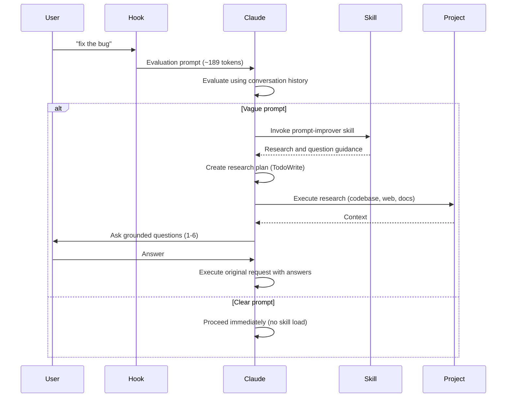

The Claude Code Prompt Improver uses a two-layer architecture that efficiently evaluates prompts and enriches vague ones with targeted clarification.

## Architecture Overview

The system separates concerns into two distinct layers:

<CardGroup cols={2}>
  <Card title="Hook Layer" icon="filter">
    Lightweight evaluation orchestrator that intercepts every prompt
  </Card>
  <Card title="Skill Layer" icon="brain">
    Comprehensive research and questioning logic loaded only when needed
  </Card>
</CardGroup>

## Request Flow



## Two-Layer Architecture

### Hook Layer: Evaluation Orchestrator

The hook (`scripts/improve-prompt.py`) is a lightweight Python script that runs on every prompt submission:

- **Intercepts prompts** via stdin/stdout JSON (~70 lines)
- **Handles bypass prefixes**: `*`, `/`, `#`
- **Wraps prompts** with evaluation instructions (~189 tokens)
- **Delegates to Claude** for clarity evaluation using conversation history
- **Instructs Claude** to invoke the skill only if prompt is vague

<Info>
The hook runs on every prompt but remains minimal to avoid overhead. It only adds evaluation logic, not the full enrichment workflow.
</Info>

### Skill Layer: Research & Questions

The skill (`skills/prompt-improver/`) contains the comprehensive enrichment logic:

- **SKILL.md**: Core workflow and instructions (~170 lines)
  - 4-phase process: Research → Questions → Clarify → Execute
  - Assumes prompt already determined vague by hook
  - Links to reference files for progressive disclosure

- **references/**: Detailed guides loaded on-demand
  - `question-patterns.md`: Question templates (200-300 lines)
  - `research-strategies.md`: Context gathering strategies (300-400 lines)
  - `examples.md`: Real transformations (200-300 lines)

<Note>
The skill layer is only loaded when a prompt is determined to be vague. Clear prompts never trigger the skill, avoiding unnecessary context overhead.
</Note>

## Evaluation Process

When you submit a prompt, the hook wraps it with evaluation instructions (~189 tokens) that guide Claude to:

1. **Assess clarity** using conversation history and context
2. **Determine if enrichment is needed** based on specificity
3. **Proceed immediately** if clear, or **invoke the skill** if vague

### Clear Prompt Flow

**Total overhead: ~189 tokens**

1. Hook wraps prompt with evaluation instructions
2. Claude evaluates: prompt is clear and specific
3. Claude proceeds immediately with the original request
4. **No skill invocation** - zero skill overhead

**Example:**
```bash
$ claude "Fix TypeError in src/components/Map.tsx line 127 where mapboxgl.Map constructor is missing container option"
```

Claude proceeds immediately without questions because the prompt specifies:
- Error type (TypeError)
- File location (src/components/Map.tsx:127)
- Root cause (missing container option)

### Vague Prompt Flow

**Total overhead: ~189 tokens + skill load**

1. Hook wraps prompt with evaluation instructions
2. Claude evaluates: prompt is vague
3. Claude invokes `prompt-improver` skill
4. Skill loads research and questioning guidance
5. Claude creates research plan, gathers context, asks 1-6 questions
6. User answers questions
7. Claude executes original request with full context

**Example:**
```bash
$ claude "fix the error"
```

Claude asks:
```
Which error needs fixing?
  ○ TypeError in src/components/Map.tsx (recent change)
  ○ API timeout in src/services/osmService.ts
  ○ Other (paste error message)
```

You select an option, and Claude proceeds with full context.

## Progressive Disclosure Benefits

The two-layer architecture enables efficient progressive disclosure:

<CardGroup cols={2}>
  <Card title="Clear Prompts" icon="rocket">
    **Never load skill**  
    Zero skill overhead - evaluation only (~189 tokens)
  </Card>
  <Card title="Vague Prompts" icon="magnifying-glass">
    **Load skill when needed**  
    Full research and questioning guidance loaded progressively
  </Card>
</CardGroup>

### Why This Matters

- **Clear prompts benefit:** Most prompts are clear and proceed with minimal overhead
- **Vague prompts get help:** Only load comprehensive guidance when actually needed
- **Zero context penalty:** Reference materials only load on-demand
- **Efficient token usage:** 31% reduction vs embedded evaluation logic

<Info>
This architecture achieves ~5.7k tokens overhead for a 30-message session (~2.8% of 200k context), down from 4.1% in previous versions.
</Info>

## Why Main Session (Not Subagent)?

The enrichment happens in your main conversation session, not in a separate subagent:

✅ **Has conversation history** - Can use context from previous messages  
✅ **No redundant exploration** - Avoids re-researching what's already known  
✅ **More transparent** - You see the evaluation and research process  
✅ **More efficient overall** - Leverages existing context instead of rebuilding it

<Tip>
You can also invoke the skill manually without the hook:
```
Use the prompt-improver skill to research and clarify: "add authentication"
```
</Tip>