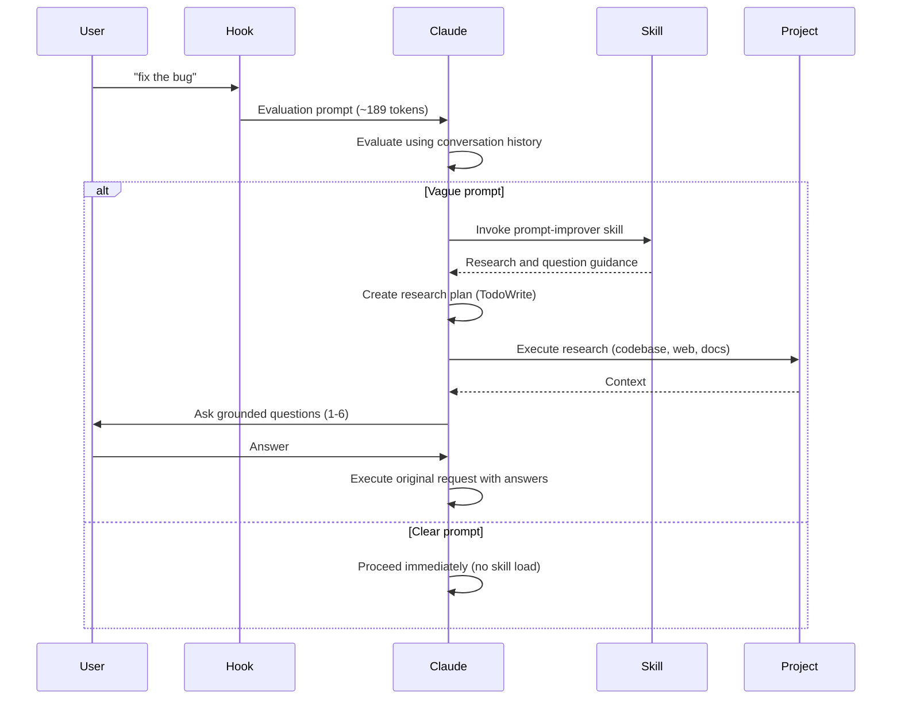

<Note>
**Requirements:** Claude Code 2.0.22+ (uses AskUserQuestion tool for targeted clarifying questions)
</Note>

## What It Does

The Claude Code Prompt Improver intercepts and evaluates prompts before Claude Code executes them. For vague prompts, Claude researches your codebase and asks 1-6 targeted clarifying questions. For clear prompts, it proceeds immediately with zero skill overhead.

**Result:** Better outcomes on the first try, without back-and-forth.

<CardGroup cols={2}>
  <Card title="Quick Start" icon="rocket" href="/quickstart">
    Get up and running in 5 minutes with marketplace installation
  </Card>
  <Card title="How It Works" icon="diagram-project" href="/guides/how-it-works">
    Understand the hook evaluation and skill-based enrichment flow
  </Card>
  <Card title="Architecture" icon="cube" href="/architecture/overview">
    Learn about the skill-based architecture and progressive disclosure
  </Card>
  <Card title="Examples" icon="lightbulb" href="/examples/prompt-transformations">
    See real prompt transformations from vague to precise
  </Card>
</CardGroup>

## Key Features

<CardGroup cols={2}>
  <Card title="Hook-Level Evaluation" icon="filter">
    Evaluates prompt clarity using conversation history before any processing
  </Card>
  <Card title="Research-Driven Questions" icon="magnifying-glass">
    Asks 1-6 grounded questions based on actual codebase exploration
  </Card>
  <Card title="Progressive Disclosure" icon="layer-group">
    Zero skill overhead for clear prompts, comprehensive guidance for vague ones
  </Card>
  <Card title="31% Token Reduction" icon="gauge-high">
    Optimized architecture reduces token overhead by 31% vs previous version
  </Card>
  <Card title="Bypass Prefixes" icon="forward">
    Full user control with `*`, `/`, and `#` prefixes
  </Card>
  <Card title="Conversation Aware" icon="messages">
    Leverages conversation history to avoid redundant exploration
  </Card>
</CardGroup>

## How It Works



## Example: Vague vs Clear

<Tabs>
  <Tab title="Vague Prompt">
    ```bash
    claude "fix the error"
    ```

    **Claude asks:**
    ```
    Which error needs fixing?
      ○ TypeError in src/components/Map.tsx (recent change)
      ○ API timeout in src/services/osmService.ts
      ○ Other (paste error message)
    ```

    You select an option, Claude proceeds with full context.
  </Tab>
  <Tab title="Clear Prompt">
    ```bash
    claude "Fix TypeError in src/components/Map.tsx line 127 where mapboxgl.Map constructor is missing container option"
    ```

    Claude proceeds immediately without questions.
  </Tab>
</Tabs>

## Installation

Get started with the prompt improver in minutes.

<Steps>
  <Step title="Add the marketplace">
    ```bash
    claude plugin marketplace add severity1/severity1-marketplace
    ```
  </Step>
  <Step title="Install the plugin">
    ```bash
    claude plugin install prompt-improver@severity1-marketplace
    ```
  </Step>
  <Step title="Restart Claude Code">
    Verify installation with `/plugin` command. You should see the prompt-improver plugin listed.
  </Step>
</Steps>

<Card title="View detailed installation options" icon="download" href="/installation">
  See marketplace, local development, and manual installation methods
</Card>

## Design Philosophy

<AccordionGroup>
  <Accordion title="Rarely intervene">
    Most prompts pass through unchanged. The hook only asks questions when genuinely unclear.
  </Accordion>
  <Accordion title="Trust user intent">
    Evaluation uses conversation history to understand context and avoid redundant exploration.
  </Accordion>
  <Accordion title="Progressive disclosure">
    Clear prompts have zero skill overhead. Vague prompts get comprehensive research and questioning.
  </Accordion>
  <Accordion title="Focused questioning">
    Max 1-6 questions — enough for complex scenarios, but still focused and actionable.
  </Accordion>
  <Accordion title="Transparent">
    Evaluation and research process visible in conversation for full transparency.
  </Accordion>
</AccordionGroup>

## Next Steps

<CardGroup cols={2}>
  <Card title="Installation Guide" icon="download" href="/installation">
    Detailed installation options and verification steps
  </Card>
  <Card title="Usage Patterns" icon="terminal" href="/guides/usage-patterns">
    Learn normal use, bypass prefixes, and manual skill invocation
  </Card>
  <Card title="Architecture Overview" icon="sitemap" href="/architecture/overview">
    Deep dive into hook-level evaluation and skill-based enrichment
  </Card>
  <Card title="Troubleshooting" icon="wrench" href="/advanced/troubleshooting">
    Common issues and solutions
  </Card>
</CardGroup>
