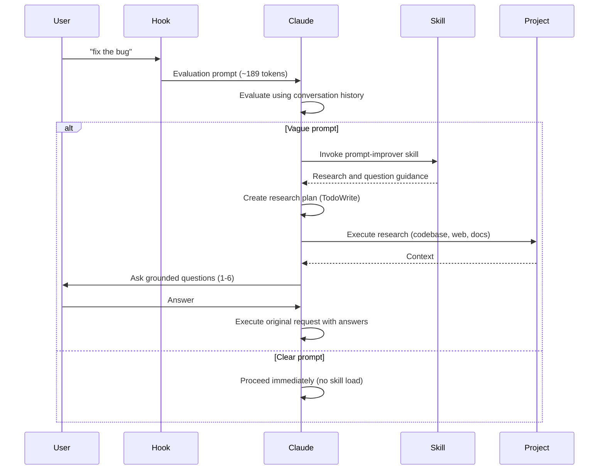

## What It Does

The Claude Code Prompt Improver is a UserPromptSubmit hook that intercepts your prompts and evaluates their clarity. When you submit a vague prompt, Claude automatically:

- **Checks clarity** using your conversation history
- **For clear prompts**: proceeds immediately with zero skill overhead
- **For vague prompts**: invokes the `prompt-improver` skill to create a research plan, gather context, and ask 1-6 grounded questions
- **Proceeds** with your original request using the clarifications

**Result:** You get better outcomes on the first try, without back-and-forth.

<Note>
**Version 0.4.0 Update**: The skill-based architecture with hook-level evaluation achieves 31% token reduction. Clear prompts have zero skill overhead, while vague prompts get comprehensive research and questioning via the skill.
</Note>

## Key Benefits

The Prompt Improver delivers immediate value through:

**Efficient for clear prompts**
- Minimal overhead (~189 tokens for evaluation)
- No skill loading when your prompt is already clear
- Proceeds immediately with execution

**Comprehensive for vague prompts**
- Dynamic research planning based on what needs clarification
- Context gathered from your codebase, conversation history, and external sources
- Targeted questions (1-6) grounded in actual project research
- Transparent process visible in your conversation

**Adaptive by default**
- Uses conversation history to avoid redundant exploration
- Respects user intent - only intervenes when genuinely needed
- Bypass options available when you want to skip evaluation

## Design Philosophy

The plugin follows five core principles:

- **Rarely intervene** - Most prompts pass through unchanged
- **Trust user intent** - Only ask when genuinely unclear
- **Use conversation history** - Avoid redundant exploration
- **Max 1-6 questions** - Enough for complex scenarios, still focused
- **Transparent** - Evaluation visible in conversation

## Architecture Overview

The Prompt Improver uses a two-layer architecture that separates evaluation from enrichment:

### Hook Layer (Evaluator)

The hook (`scripts/improve-prompt.py`) intercepts prompts via stdin/stdout JSON and:

1. Handles bypass prefixes (`*`, `/`, `#`)
2. Wraps prompts with evaluation instructions (~189 tokens)
3. Lets Claude evaluate clarity using conversation history
4. For vague prompts: instructs Claude to invoke the `prompt-improver` skill

### Skill Layer (Enrichment)

The skill (`skills/prompt-improver/`) provides research and question guidance:

- **SKILL.md**: 4-phase workflow (Research → Questions → Clarify → Execute)
- **references/**: Detailed guides loaded on-demand
  - `question-patterns.md`: Question templates and best practices
  - `research-strategies.md`: Context gathering strategies
  - `examples.md`: Real prompt transformations

### Progressive Disclosure

**Clear prompts:**
1. Hook wraps with evaluation prompt (~189 tokens)
2. Claude evaluates: prompt is clear
3. Claude proceeds immediately (no skill invocation)
4. **Total overhead: ~189 tokens**

**Vague prompts:**
1. Hook wraps with evaluation prompt (~189 tokens)
2. Claude evaluates: prompt is vague
3. Claude invokes `prompt-improver` skill
4. Skill loads research/question guidance
5. Claude creates research plan, gathers context, asks questions
6. **Total overhead: ~189 tokens + skill load**

This architecture means you only pay the cost of enrichment when you actually need it.

## How It Works

Here's the complete flow when you submit a prompt:

## Next Steps

Ready to get started?

<CardGroup cols={2}>
  <Card title="Installation" icon="download" href="/installation">
    Install the plugin via marketplace, local development, or manual setup
  </Card>
  <Card title="Quick Start" icon="rocket" href="/quickstart">
    Get from zero to first usage in under 5 minutes
  </Card>
</CardGroup>