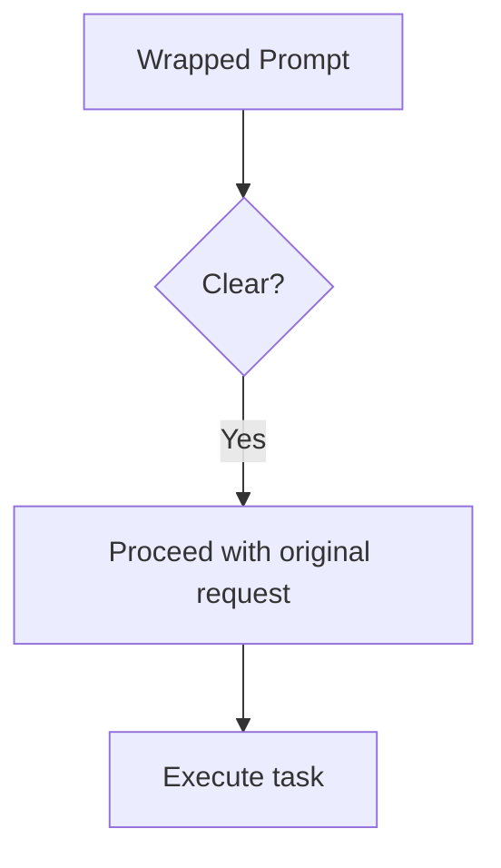
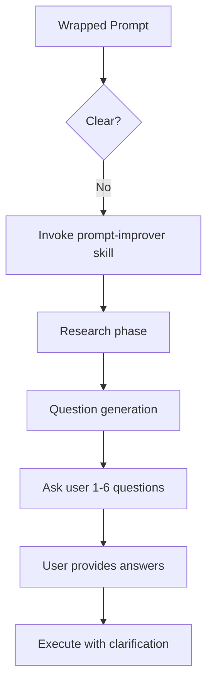

## Overview

The hook's evaluation logic determines whether prompts are clear enough to execute immediately or require enrichment via the [prompt-improver skill](/reference/skill/overview). The evaluation happens in two stages:

1. **Bypass detection** (hook script)
2. **Clarity evaluation** (Claude using conversation history)

## Bypass Conditions

The hook checks for three bypass prefixes **before** wrapping the prompt with evaluation instructions. These prefixes allow users to skip evaluation entirely.

### 1. Explicit Bypass (`*`)

Skips evaluation and removes the `*` prefix from the prompt.

```python scripts/improve-prompt.py:35-39
if prompt.startswith("*"):
    # User explicitly bypassed improvement - remove * prefix
    clean_prompt = prompt[1:].strip()
    output_json(clean_prompt)
    sys.exit(0)
```

**Example:**

```bash
# Input
claude "* add dark mode"

# Hook output
{
  "hookSpecificOutput": {
    "hookEventName": "UserPromptSubmit",
    "additionalContext": "add dark mode"
  }
}
```

<Note>
  The `*` prefix is **completely removed** from the prompt before it reaches Claude. This allows users to forcibly bypass evaluation for any prompt.
</Note>

### 2. Slash Commands (`/`)

Built-in and custom slash commands automatically bypass evaluation.

```python scripts/improve-prompt.py:41-44
if prompt.startswith("/"):
    # Slash command - pass through unchanged
    output_json(prompt)
    sys.exit(0)
```

**Example:**

```bash
# Input
claude "/help"

# Hook output
{
  "hookSpecificOutput": {
    "hookEventName": "UserPromptSubmit",
    "additionalContext": "/help"
  }
}
```

### 3. Memorize Feature (`#`)

Claude Code's memorize feature automatically bypasses evaluation.

```python scripts/improve-prompt.py:46-49
if prompt.startswith("#"):
    # Memorize feature - pass through unchanged
    output_json(prompt)
    sys.exit(0)
```

**Example:**

```bash
# Input
claude "# remember to use rg over grep"

# Hook output
{
  "hookSpecificOutput": {
    "hookEventName": "UserPromptSubmit",
    "additionalContext": "# remember to use rg over grep"
  }
}
```

## Prompt Wrapping Logic

When no bypass condition is detected, the hook wraps the user's prompt with evaluation instructions.

### Escaped Prompt Handling

The hook escapes special characters to safely embed the user's prompt in the evaluation wrapper:

```python scripts/improve-prompt.py:19
escaped_prompt = prompt.replace("\\", "\\\\").replace('"', '\\"')
```

This ensures that prompts containing quotes or backslashes don't break the JSON structure.

**Example:**

```python
# Original prompt
fix the "authentication" bug in src/auth.ts

# Escaped prompt
fix the \"authentication\" bug in src/auth.ts
```

### Evaluation Prompt

The hook wraps the escaped prompt with a **~189 token** evaluation instruction:

```python scripts/improve-prompt.py:52-68
wrapped_prompt = f"""PROMPT EVALUATION

Original user request: "{escaped_prompt}"

EVALUATE: Is this prompt clear enough to execute, or does it need enrichment?

PROCEED IMMEDIATELY if:
- Detailed/specific OR you have sufficient context OR can infer intent

ONLY USE SKILL if genuinely vague (e.g., "fix the bug" with no context):
- If vague:
  1. First, preface with brief note: "Hey! The Prompt Improver Hook flagged your prompt as a bit vague because [specific reason: ambiguous scope/missing context/unclear target/etc]."
  2. Then use the prompt-improver skill to research and generate clarifying questions
- The skill will guide you through research, question generation, and execution
- Trust user intent by default. Check conversation history before using the skill.

If clear, proceed with the original request. If vague, invoke the skill."""

output_json(wrapped_prompt)
sys.exit(0)
```

<Note>
  This evaluation prompt is the **entire overhead** for clear prompts. Claude evaluates clarity using conversation history and proceeds immediately without loading the skill.
</Note>

## Decision Flow

Claude evaluates the wrapped prompt using conversation history to determine clarity.

### Clear Prompt Path

When the prompt is **detailed, specific, or has sufficient context**, Claude proceeds immediately:



**Example (clear prompt):**

```bash
# Input
claude "Fix TypeError in src/components/Map.tsx line 127 where mapboxgl.Map constructor is missing container option"

# Evaluation
PROCEED IMMEDIATELY if:
- Detailed/specific ✓ (file, line, error, fix described)
- Sufficient context ✓

# Claude proceeds immediately without asking questions
```

**Criteria for "clear":**

- **Detailed/specific**: File paths, line numbers, error messages, specific features
- **Sufficient context**: Conversation history provides missing details
- **Inferable intent**: Claude can reasonably determine what the user wants

### Vague Prompt Path

When the prompt is **genuinely vague** (e.g., "fix the bug" with no context), Claude invokes the skill:



**Example (vague prompt):**

```bash
# Input
claude "fix the error"

# Evaluation
ONLY USE SKILL if genuinely vague ✓
- Ambiguous scope (which error?)
- Missing context (no file, no error message)
- Unclear target (which component?)

# Claude response
Hey! The Prompt Improver Hook flagged your prompt as a bit vague because it lacks specific context about which error to fix.

[Invokes prompt-improver skill]
[Researches codebase for recent errors]
[Asks targeted questions]
```

**Criteria for "vague":**

- **Ambiguous scope**: "the bug", "the error", "the issue" without context
- **Missing context**: No file paths, error messages, or specific details
- **Unclear target**: "add tests" without specifying what to test
- **Generic requests**: "improve performance", "add feature" without specifics

<Note>
  The evaluation emphasizes **trusting user intent by default**. Claude should check conversation history before invoking the skill to avoid redundant questions.
</Note>

## Evaluation Transparency

The evaluation wrapper is designed to be **visible in conversation** for transparency:

1. **User sees evaluation**: The wrapped prompt appears in the conversation
2. **Explanation on intervention**: When vague, Claude explains why before asking questions
3. **No hidden magic**: Users understand when and why clarification happens

**Example conversation:**

```
User: fix the bug

Claude: Hey! The Prompt Improver Hook flagged your prompt as a bit vague because it doesn't specify which bug to fix.

Let me research the codebase to identify recent issues...

[Research phase using TodoWrite]
[Codebase exploration]

Which bug would you like me to fix?
  ○ TypeError in src/components/Map.tsx (recent change)
  ○ API timeout in src/services/osmService.ts
  ○ Other (paste error message)
```

## Progressive Disclosure

The hook implements a **progressive disclosure pattern** to minimize token overhead:

1. **Hook level** (~189 tokens): Evaluation instructions only
2. **Skill level** (loaded on-demand): Research and question guidance
3. **Reference level** (loaded on-demand): Detailed examples and strategies

**Token usage comparison:**

| Prompt Type | Hook Overhead | Skill Load | Total Overhead |
|-------------|---------------|------------|----------------|
| Clear       | ~189 tokens   | 0 tokens   | ~189 tokens    |
| Vague       | ~189 tokens   | ~170 lines | ~189 + skill   |

<Note>
  Clear prompts have **zero skill overhead** because Claude proceeds immediately. Only vague prompts trigger skill loading, achieving a 31% token reduction compared to v0.3.x (275 tokens per prompt).
</Note>

## Implementation Notes

### Why Conversation History Matters

The evaluation relies heavily on **conversation history** to avoid asking redundant questions:

```python
# Evaluation instruction (excerpt)
"Trust user intent by default. Check conversation history before using the skill."
```

**Example:**

```
User: I'm working on the authentication system in src/auth.ts
Claude: [Remembers context]

User: add tests
Claude: [Evaluates: "add tests" is clear because conversation history specifies src/auth.ts authentication]
Claude: [Proceeds immediately without questions]
```

### Why Main Session (Not Subagent)

The evaluation happens in the **main session** rather than a subagent:

- **Has conversation history**: Can leverage prior context
- **No redundant exploration**: Avoids re-exploring known information
- **More transparent**: User sees evaluation in conversation
- **More efficient**: No subagent overhead for simple evaluation

See the [prompt-improver skill reference](/reference/skill/overview) for details on the enrichment phase when prompts are determined to be vague.